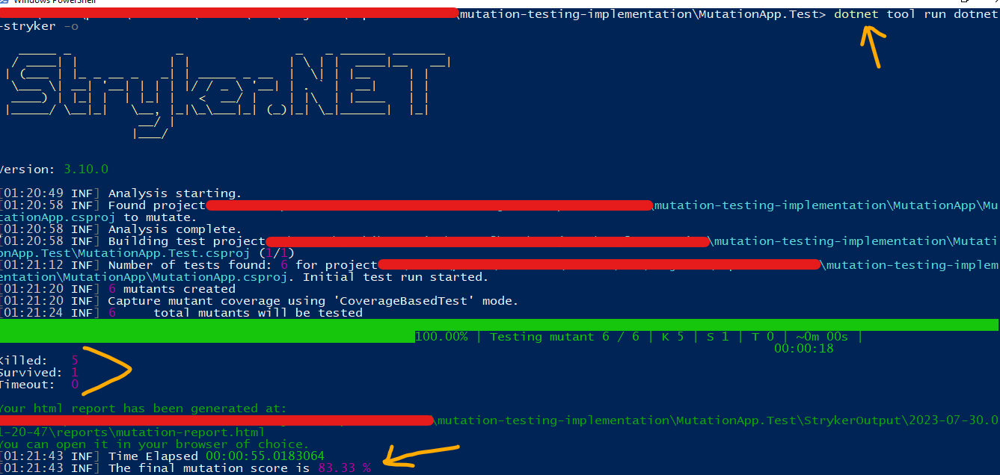
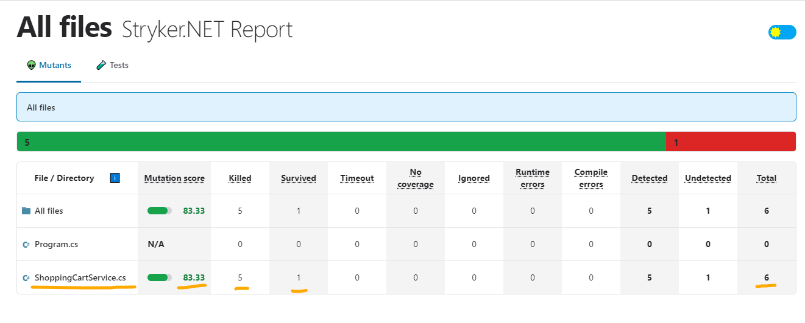
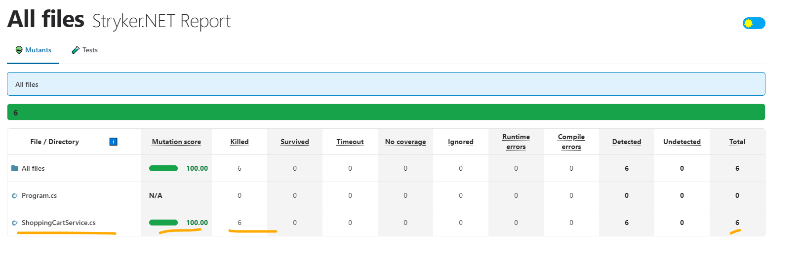

# Mutation Testing Implementation

This repository contains an implementation of Mutation Testing for a C# project using Stryker.

## 1. Prerequisites

Before getting started, make sure you have the following installed:

### 1.1 Install Visual Studio with .NET

Download and install Visual Studio 2019 from the official website: [Visual Studio Download](https://visualstudio.microsoft.com/vs/older-downloads/). Install necessary dotnet libraries while installing through the Visual Studio Installer.

### 1.2 Install Stryker

To install Stryker, follow the instructions in the [Stryker GitHub repository](https://github.com/stryker-mutator/stryker-net). Or, simply run the following command to install the dotnet-stryker globally.

```
dotnet tool install -g dotnet-stryker
```

### 1.3 Clone this project

Clone this repository to your local machine using the following command:

```
git clone https://github.com/prabinKshrestha/mutation-testing-implementation.git
```

### 1.4 Open the project folder and solutions

Navigate to the cloned project folder and open the solution in Visual Studio. The project structure will be explained in later sections.

To run the mutation testing using the stryker tool, execute the following command. Note that you should be in the MutationApp.Test directory.

```
dotnet tool run dotnet-stryker -o
```

## 2. Background of Mutation Analysis

Mutation Testing is a technique to evaluate the effectiveness of your test suite by injecting faults (mutations) into your code and checking if your tests can detect those mutations. To learn more about Mutation Testing, refer to the detailed report in the repository: [Mutation Analysis](documentation/mutation_analysis_report.pdf).

Generating mutants can be a laborious task due to the potential creation of thousands of mutants when dealing with large and complex applications. Manual mutation testing under such circumstances becomes practically impossible. To address this challenge effectively, it is crucial to have automated mutant generation and the ability to test test suites against them. This is where specialized tools prove invaluable. In the case of C# codes, Stryker has been selected as the tool of choice to automate mutation testing and streamline the process efficiently.

## 3. Implementation

The project has been developed following the Test-Driven Development (TDD) approach, a methodology where comprehensive test cases are written based on the expected behavior of the code. This ensures that each unit of code is thoroughly tested before implementing the corresponding functionality. Additionally, mutation testing is performed by running the tests again to identify and address potential bugs or shortcomings. 

### 3.1 Folder Structure of the source code

The solution consists of two projects. 

Please note that the projects does not have complete class and test class as the it is intended only to demonstrate the implementation of mutation testing. However, it is sufficient for the purpose of this demonstration.

#### MutationApp project

This project contains the main application. It includes the ShoppingCartService file with following classes:

- `ShoppingCartService`: This is the service file responsible for handling shopping cart operations.
- `CartItem`: This is a model class used in the application. 

Snippet of C# code for `ShoppingCartService`:

```csharp

using System.Collections.Generic;
using System.Linq;

namespace MutationApp
{
    /*
     * Incomplete class for Shopping Cart Service
     * This class is incomplete because it is created to show the implementation of Mutation Testing.
     * */
    public class ShoppingCartService
    {
        /* Minimum Quantity to get discount */
        public readonly static int DISCOUNT_THRESHOLD_QUANTITY = 5;
        /* Cart Items of shopping cart */
        public readonly List<CartItem> items;

        /* Constructor */
        public ShoppingCartService() { items = new List<CartItem>(); }

        /* Add Item to the list */
        public void AddItem(CartItem item) => items.Add(item);

        /* Remove Item from the list */
        public void RemoveItem(CartItem item) => items.Remove(item);

        /* Check if shopping cart is empty */
        public bool IsEmpty() => items.Count == 0;

        /* Check if cart is eligible for discount */
        public bool IsDiscountEligible() => items.Count >= DISCOUNT_THRESHOLD_QUANTITY;   

        /* Calculate and returns the total price without discount */
        public decimal CalculateTotalPriceWithoutDiscount() => items.Select(item => item.Price * item.Quantity).Sum();
    }

    /* Model Class to represent the Cart Item */
    public class CartItem
    {
        public string Name { get; set; }
        public decimal Price { get; set; }
        public int Quantity { get; set; }
    }
}

```

#### MutationApp.Test project

This project contains the test class `ShoppingCartServiceTest`, which tests the functionality of `ShoppingCartService`. The test snippet is provided below:

```csharp

using NUnit.Framework;

namespace MutationApp.Test
{
    /*
     * Test class for Shopping Cart Service
     * */
    public class ShoppingCartServiceTest
    {
        [Test]
        public void CalculateTotalPrice_ShouldReturnZero_WhenCartIsEmpty()
        {
            decimal totalPrice = new ShoppingCartService().CalculateTotalPriceWithoutDiscount();
            Assert.AreEqual(0, totalPrice);     // Assert
        }

        [Test]
        public void CalculateTotalPrice_ShouldReturnCorrectTotalPrice_WhenCartHasItems()
        {
            ShoppingCartService cart = new ShoppingCartService();
            cart.AddItem(new CartItem { Name = "Item 1", Price = 10, Quantity = 2 });
            cart.AddItem(new CartItem { Name = "Item 2", Price = 5, Quantity = 3 });
            decimal totalPrice = cart.CalculateTotalPriceWithoutDiscount(); 
            Assert.AreEqual(35, totalPrice);    // Assert
        }

        [Test]
        public void IsEmpty_ShouldReturnTrue_WhenCartIsEmpty()
        {
            bool isEmpty = new ShoppingCartService().IsEmpty();
            Assert.True(isEmpty);               // Assert
        }

        [Test]
        public void IsEmpty_ShouldReturnFalse_WhenCartIsNotEmpty()
        {
            ShoppingCartService cart = new ShoppingCartService();
            cart.AddItem(new CartItem { Name = "Item 1", Price = 10, Quantity = 1 });
            bool isEmpty = cart.IsEmpty();
            Assert.False(isEmpty);              // Assert
        }

        [Test]
        public void IsDiscountEligible_ShouldReturnTrue_WhenCartItemsIs9()
        {
            ShoppingCartService cart = new ShoppingCartService();
            for (int i = 1; i <= 9; i++)
            {
                cart.AddItem(new CartItem { Name = $"Item {i}", Price = i * 10, Quantity = 1 });
            }
            bool isEligible = cart.IsDiscountEligible();
            Assert.True(isEligible);              // Assert
        }

        [Test]
        public void IsDiscountEligible_ShouldReturnFalse_WhenCartItemsIs2()
        {
            ShoppingCartService cart = new ShoppingCartService();
            for (int i = 1; i <= 2; i++)
            {
                cart.AddItem(new CartItem { Name = $"Item {i}", Price = i * 10, Quantity = 1 });
            }
            bool isEligible = cart.IsDiscountEligible();
            Assert.False(isEligible);              // Assert
        }

        /*
         * Uncomment the following section to get 100% mutation score. 
         * With the following section commented or missing, mutatant generated by changing method IsDiscountEligible will survive
         * With the mutant being survived, we know either program code is wrong or test cases are not enough. 
         * So, we add following code to fulfill the test coverage.
         * The following code actually checks the boundy condition
         * */

        //[Test]
        //public void IsDiscountEligible_ShouldReturnTrue_WhenCartItemsIs5()
        //{
        //    ShoppingCartService cart = new ShoppingCartService();
        //    for (int i = 1; i <= ShoppingCartService.DISCOUNT_THRESHOLD_QUANTITY; i++)
        //    {
        //        cart.AddItem(new CartItem { Name = $"Item {i}", Price = i * 10, Quantity = 1 });
        //    }
        //    bool isEligible = cart.IsDiscountEligible();
        //    Assert.True(isEligible);              // Assert
        //}
    }
}

```

To run the tests, execute them using Visual Studio or any preferred testing framework. However, manual execution is not required since Stryker will handle it automatically - because according to mutation analysis, before testing on mutants, the program should pass the test suite successfully. 

Go to the MutationApp.Test directory if you are not in the directory:

```
cd MutationApp.Test
```

Run the following command to run the Sryker:

```
dotnet tool run dotnet-stryker -o
```

You will see the run of this command similar to following. 



After executing the command mentioned above, the web page will open in the default browser, displaying the report as follows. You can preview the report on [Survived Example Mutation Report](https://htmlpreview.github.io/?https://github.com/prabinKshrestha/mutation-testing-implementation/documentation/assets/survived-mutation-run-mutation-report.html).




In the report, it is evident that 6 mutants were created from the ShoppingCartService, out of which 5 were killed, resulting in a Mutation Score of 83.33%. Clicking on the ShoppingCartService.cs link reveals detailed information about the generated mutants, including the code changes made to create each mutant and its status (killed or survived). When expanding each underlined part, the mutant is displayed, shown in red if it survived or green if it was killed.

As observed, one of the mutants managed to survive when the >= operator was changed to the > operator in the IsDiscountEligible function. This points to our test case not covering the boundary case, specifically the DISCOUNT_THRESHOLD_QUANTITY condition.

To address this issue, we will add another test to cover the missing test. In the ShoppingCartServiceTest class, uncomment the previously commented method IsDiscountEligible_ShouldReturnTrue_WhenCartItemsIs5(), ensuring that the following code is now executed during the test.

```csharp

[Test]
public void IsDiscountEligible_ShouldReturnTrue_WhenCartItemsIs5()
{
    ShoppingCartService cart = new ShoppingCartService();
    for (int i = 1; i <= ShoppingCartService.DISCOUNT_THRESHOLD_QUANTITY; i++)
    {
        cart.AddItem(new CartItem { Name = $"Item {i}", Price = i * 10, Quantity = 1 });
    }
    bool isEligible = cart.IsDiscountEligible();
    Assert.True(isEligible);              // Assert
}

```

Rerun Stryker using the following command:

```
dotnet tool run dotnet-stryker -o
```

As before, after the run of the above command, it should open the web page with the following result. You can also preview the report on [All Killed Example Mutation Report](https://htmlpreview.github.io/?https://github.com/prabinKshrestha/mutation-testing-implementation/documentation/assets/all-killed-mutation-report.html).



Now, you can see that all mutants have been killed with Mutation Score 100%, indicating that our test cases, though limited, are sufficient for the code.
